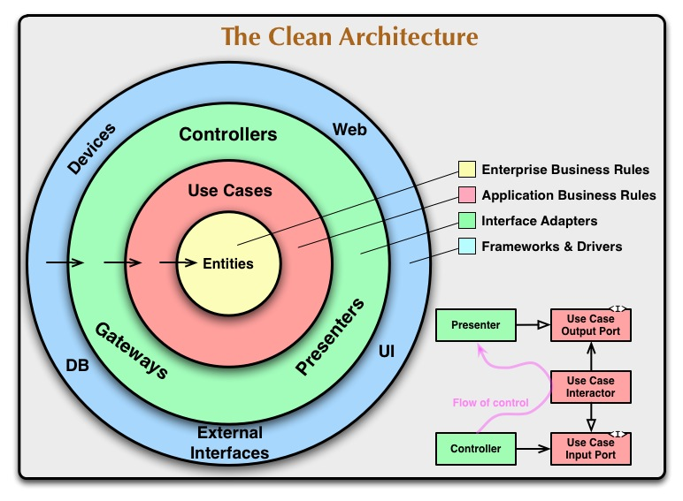

# AV Patient Manager

Repositorio de nuestra RESTful API del E-Commerce. Diseñada con:

- `Nodejs:` https://nodejs.org/docs/latest/api/
- `Express:` https://expressjs.com/
- `Typescript:` https://www.typescriptlang.org/docs/
- `Tsoa:` https://tsoa-community.github.io/docs/getting-started.html

 

## Arquitectura: Clean Architecture

Arquitectura familiarizada por Robert C. Martin. Es una forma de organizar nuestro código para que:

###### 👉 La lógica de negocio sea lo más importante.

###### 👉 No dependa de frameworks, bases de datos ni UI.

###### 👉 Sea fácil de cambiar, testear y mantener.

`Las dependencias siempre apuntan hacia el negocio. Nunca al revés.`

###### Biblioteca

- https://github.com/panagiop/node.js-clean-architecture/tree/master
- https://jmfloreszazo.com/nodejs-clean-architecture/

 

src/
│
├── domain/ # Reglas de negocio (núcleo)
│ ├── entities/
│ │ ├── User.ts
│ │ └── Product.ts
│ │
│ ├── repositories/
│ │ ├── IUserRepository.ts
│ │ └── IProductRepository.ts
│ │
│ ├── valueObjects/
│ │
│ ├── enums/
│ │
│ └── errors/
│
├── application/ # Casos de uso
│ ├── use-cases/
│ │ ├── users/
│ │ │ ├── CreateUserUseCase.ts
│ │ │ ├── UpdateUserUseCase.ts
│ │ │ └── DeleteUserUseCase.ts
│ │ │
│ │ └── products/
│ │
│ ├── dto/
│ │
│ ├── mappers/
│ │
│ └── services/
│
├── infrastructure/ # Implementaciones
│ ├── database/
│ │ ├── datasource.ts
│ │ ├── migrations/
│ │ └── entities/
│ │
│ ├── repositories/
│ │ ├── UserRepository.ts
│ │ └── ProductRepository.ts
│ │
│ ├── providers/
│ │ ├── JwtProvider.ts
│ │ ├── HashProvider.ts
│ │ └── MailProvider.ts
│ │
│ └── config/
│
├── presentation/ # Entrada de la aplicación
│ ├── controllers/
│ │
│ ├── routes/
│ │
│ ├── middlewares/
│ │
│ ├── validators/
│ │
│ └── responses/
│
├── shared/
│ ├── utils/
│ ├── constants/
│ ├── logger/
│ ├── errors/
│ └── types/
│
├── container/ # Inyección de dependencias
│ └── index.ts
│
├── app.ts # Configuración de Express
└── server.ts # Inicio del servidor
